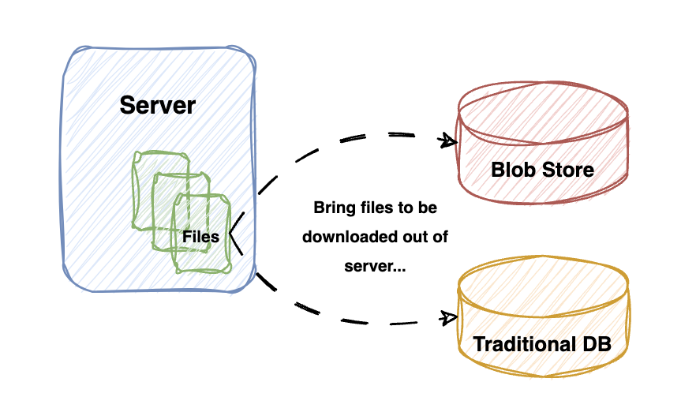

# File Download Recipe

### Scenario

I visited one website where they just asked to click the button, and my requested file got downloaded!!! Nice, But how do you implement it?

### What would be my approach to implement it?

When a GET request is made to the designated endpoint, the server will automatically download the file.

### Steps to Try-Out

-   Clone repo

    ```
    git clone -b file-download-recipe <repository-url>
    ```

-   Ensure that <code>node</code> is installed on your system, and execute <code>npm install</code> in the cloned repository's directory.

-   The implementation details of the scenario are outlined in the <code>app.js</code> file.

-   Initiate the development server by executing the command below, which will launch a local server instance.

    ```
    npm run dev
    ```

-   To initiate the file download, navigate to http://localhost:3000/download-file in your browser, using <code>/download-file</code> as the resource endpoint for the GET request.

### Enhancements

-   Migrate the files currently stored on the server to a <code>Blob Store</code> or <code>Traditional DB</code>. This will enhance scalability and provide better management of large or numerous files.

    


-   Implement functionality to accept the filename as a path parameter. This will allow for more flexible and user-specific file downloads.

    -   Example: <code>/download-file/hello-world.txt</code>, where we specified the filename to be downloaded within the path parameter.
